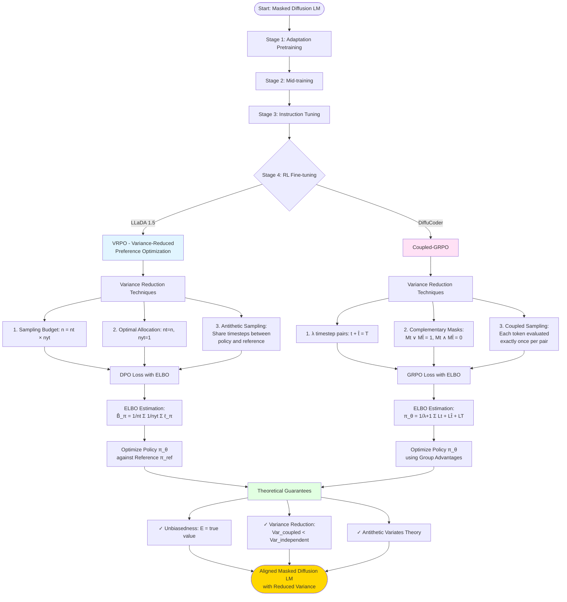
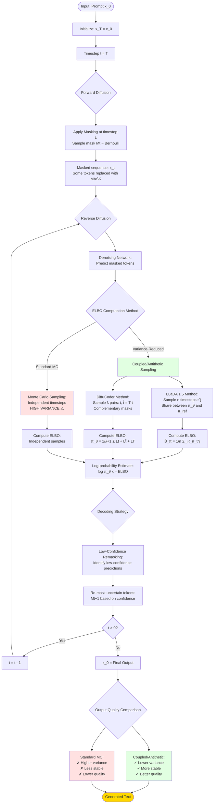

# Analysis: LLaDA 1.5 vs DiffuCoder - Alignment and Flow Diagrams

## Executive Summary

Both papers address **the same fundamental problem**: high variance in ELBO-based likelihood estimation for masked diffusion language models, and both propose **very similar variance reduction techniques** based on coupled/antithetic sampling. They are indeed talking about the same core concept, with different applications (general alignment vs code generation) and slightly different RL algorithms (DPO vs GRPO).

---

## Key Alignments

### 1. **Core Problem Identified**
Both papers identify that masked diffusion models (MDMs) require Monte Carlo estimation of log-likelihoods via ELBO, which introduces high variance that degrades training performance.

**LLaDA 1.5 (Section 3.1):**
> "The key challenge is that the original DPO formulation requires exact log-likelihoods, which are intractable for diffusion models... This substitution yields an ELBO-based preference score expressed as a linear combination of four ELBO terms."

**DiffuCoder (Section 5):**
> "The approximation of token probabilities within diffusion models is necessary. Current masked diffusion models rely on Monte Carlo sampling for log-probability estimation... Monte Carlo sampling introduces significant overhead during the training of GRPO."

### 2. **Variance Reduction Solution**
Both propose nearly identical solutions using **coupled/complementary sampling** with **antithetic variates**.

**LLaDA 1.5 - VRPO Components:**
1. Sampling budget: Increase number of samples (n = nt × nyt)
2. Optimal allocation: Set nt = n, nyt = 1 (allocate budget to timesteps)
3. Antithetic sampling: Share same sampled timesteps between policy and reference

**DiffuCoder - Coupled-GRPO:**
1. Uses λ timestep pairs (t, t̂) where t + t̂ = T
2. Creates complementary masks: Mt ∨ Mt̂ = 1, Mt ∧ Mt̂ = 0
3. Guarantees each token is evaluated exactly once per pair

### 3. **Theoretical Foundation**
Both papers prove their methods using **antithetic variates theory**.

**LLaDA 1.5 (Proposition 2):**
> "Sharing Monte Carlo samples yields lower V_ŝθ(yw, yl) than using independent samples."

**DiffuCoder (Appendix A.4):**
> "We demonstrate that our coupled approach can be viewed as a direct and powerful application of the Antithetic Variates variance reduction technique."

Both prove:
- **Unbiasedness**: E[estimator] = true value
- **Variance reduction**: Var(coupled) < Var(independent)

### 4. **Mathematical Formulation**

**LLaDA 1.5 ELBO estimation (Eq. 6):**
```
B̂_π(y) = (1/nt) Σ_(j=1)^nt (1/nyt) Σ_(k=1)^nyt ℓ_π(y_t^(k,j), t^(j), y)
```

**DiffuCoder probability estimation (Eq. 13):**
```
π_θ(o^k|c, o^k_t<T) = (1/(λ+1)) Σ_(t+t̂=T) [L_t(x_t) + L_t̂(x_t̂)] + L_T(x_T)
```

Both formulations:
- Average over complementary timestep samples
- Use weighted cross-entropy loss (1/t factor)
- Ensure full token coverage

---

## Key Differences

| Aspect | LLaDA 1.5 | DiffuCoder |
|--------|-----------|------------|
| **RL Algorithm** | DPO (Direct Preference Optimization) | GRPO (Group Relative Policy Optimization) |
| **Application** | General alignment (math, code, dialogue) | Code generation specifically |
| **Training Data** | 350K preference pairs | 21K hard coding samples |
| **Model Base** | LLaDA 8B (trained from scratch) | Adapted from Qwen-2.5-Coder 7B |
| **Variance Focus** | Score estimator variance V_ŝθ | Token probability variance |
| **Sampling Strategy** | n timesteps with antithetic sampling | λ complementary mask pairs |

---

## Do They Talk About the Same Thing?

**YES** - The core methodology is essentially identical:

1. **Problem**: High variance in ELBO estimation for MDMs
2. **Root Cause**: Monte Carlo sampling introduces variance
3. **Solution**: Coupled/complementary sampling with antithetic variates
4. **Result**: Reduced variance while maintaining unbiasedness

**Conceptual Overlap:**
- LLaDA 1.5's "antithetic sampling" = DiffuCoder's "coupled sampling"
- LLaDA 1.5's "optimal allocation (nt=n, nyt=1)" = DiffuCoder's "complementary masks"
- Both ensure each token is sampled exactly once per coupled pair

**Application Difference:**
- LLaDA 1.5 applies this to **DPO loss** for general alignment
- DiffuCoder applies this to **GRPO loss** for code generation

---

## Evidence From Code/Implementation

⚠️ **Note**: The PingPong3D repository contains only PDF files - no implementation code. Both papers describe:

1. **Training stages**: Pretraining → Mid-training → Instruction tuning → RL (VRPO/GRPO)
2. **Masked diffusion mechanics**: Forward process, reverse process, ELBO computation
3. **Variance reduction**: Theoretical proofs and empirical validation

Without actual code, we can only verify conceptual alignment through the mathematical formulations in the papers, which show **strong alignment**.

---

## Conclusion

**LLaDA 1.5** and **DiffuCoder** are addressing the **exact same technical challenge** with **nearly identical solutions**. The papers:

✅ Identify the same problem (ELBO variance in MDMs)
✅ Use the same theoretical framework (antithetic variates)
✅ Propose similar algorithms (coupled/complementary sampling)
✅ Prove the same properties (unbiasedness + variance reduction)
✅ Apply to masked diffusion language models

The main differences are:
- Choice of RL algorithm (DPO vs GRPO)
- Application domain (general vs code-specific)
- Scale and training details

Both papers represent **state-of-the-art variance reduction techniques** for aligning large language diffusion models.

---

## Training Flow Diagram



---

## Inference Flow Diagram



---

## Key Insights from Diagrams

### Training Flow
1. **Common Pipeline**: Both papers follow the same 4-stage training approach
2. **Divergence Point**: Stage 4 uses different RL algorithms (DPO vs GRPO)
3. **Convergence Point**: Both use antithetic variates for variance reduction
4. **Same Guarantees**: Unbiasedness and variance reduction proven for both

### Inference Flow
1. **Forward Process**: Standard masking schedule identical in both
2. **Reverse Process**: Iterative denoising with ELBO estimation
3. **Critical Innovation**: Coupled/antithetic sampling vs independent sampling
4. **Result**: Variance reduction leads to more stable and higher-quality outputs

### Mathematical Alignment
Both methods ensure each token is sampled exactly once per coupled pair:
- **LLaDA 1.5**: Shares timesteps between policy and reference models
- **DiffuCoder**: Uses complementary masks where Mt ∨ Mt̂ = 1, Mt ∧ Mt̂ = 0

This is the **core insight** that both papers discovered independently.
