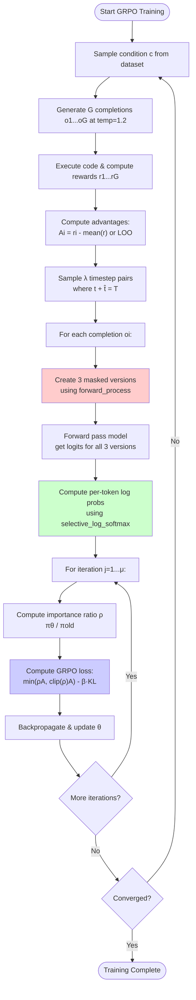
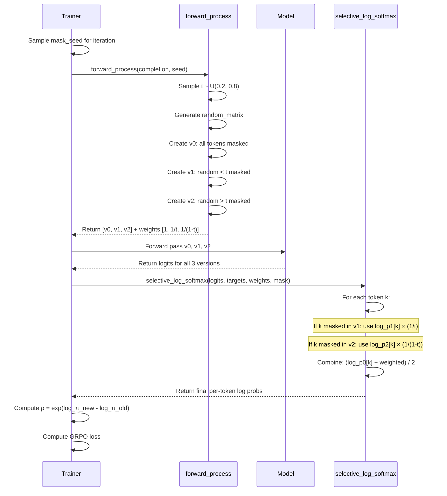

# DiffuCoder: Deep Code Investigation & Analysis

## Executive Summary

This document provides a comprehensive analysis of the DiffuCoder implementation, comparing the code with the paper's theoretical descriptions. The analysis focuses on the novel **coupled-GRPO** algorithm and the masked diffusion process.

---

## 1. Forward Process: Three Masked Versions

### 1.1 Paper Description (Section 5, Page 8-9)

The paper describes **coupled sampling** where:
- Two complementary masks are created: M_t and M_t̂ where t + t̂ = T
- Every token is masked in exactly one of the two forward passes
- This ensures **full token coverage** with reduced variance

### 1.2 Code Implementation (`forward_process` at line 254-279)

```mermaid
flowchart TD
    A[Input: batch, prompt_index] --> B[Sample mask_ratio ~ U(0.2, 0.8)]
    B --> C[Generate random_matrix ~ U(0,1)]
    C --> D1[Version 0: Full Mask]
    C --> D2[Version 1: Partial Mask with ratio t]
    C --> D3[Version 2: Complementary Mask with ratio 1-t]

    D1 --> E1["mask ALL completion tokens<br/>is_mask = ~prompt_index"]
    D2 --> E2["mask where random < t<br/>is_mask = ~prompt_index & (random < t)"]
    D3 --> E3["mask where random > t<br/>is_mask = ~prompt_index & (random > t)"]

    E1 --> F1["noisy_batch[0]<br/>weight: 1"]
    E2 --> F2["noisy_batch[1]<br/>weight: 1/t"]
    E3 --> F3["noisy_batch[2]<br/>weight: 1/(1-t)"]

    F1 & F2 & F3 --> G[Return 3 masked versions + weights]

    style D1 fill:#ffcccc
    style D2 fill:#ccffcc
    style D3 fill:#ccccff
```

### 1.3 Critical Analysis

**✓ VERIFIED**: The implementation creates 3 versions:
1. **Version 0** (Full mask): All completion tokens masked → baseline probability
2. **Version 1** (Partial mask at ratio t): Random subset of tokens masked
3. **Version 2** (Complementary mask at ratio 1-t): Inverse of Version 1

**KEY INSIGHT**: Versions 1 and 2 are **complementary** - they partition the completion tokens such that:
- `mask_v1 ∪ mask_v2 = all_completion_tokens`
- `mask_v1 ∩ mask_v2 = ∅`

This ensures every token appears unmasked in exactly one of the two versions!

---

## 2. Probability Computation: selective_log_softmax

### 2.1 Paper Equation 4 (Page 9)

```
log πθ(o^k|c, o^k_{t<T}) = 1/(λ+1) * [Σ_{t+t̂=T} [Lt(xt) + Lt̂(xt̂)] + LT(xT)]
```

Where:
- Lt(xt) = (1/t) · CE(xt, x0) for masked positions
- The sum averages over λ coupled pairs plus the full mask

### 2.2 Code Implementation (`selective_log_softmax` at lines 59-131)

```mermaid
flowchart TD
    A["Input: logits [num_iters×3×batch, seq_len, vocab]<br/>index [num_iters×batch, seq_len]<br/>weights [num_iters×3]<br/>mask [num_iters×batch, seq_len]"] --> B[Process each sequence i]

    B --> C[Extract 3 versions of logits]
    C --> D["logits_v0, logits_v1, logits_v2<br/>[3, seq_len, vocab]"]

    D --> E[Compute log_softmax for all 3 versions]
    E --> F["log_probs_v0, log_probs_v1, log_probs_v2<br/>[3, seq_len]"]

    F --> G{For each token k}
    G -->|mask[k]==True| H["Use v1:<br/>weighted_logp = v1 × weight[1]"]
    G -->|mask[k]==False| I["Use v2:<br/>weighted_logp = v2 × weight[2]"]

    H & I --> J["Combine:<br/>final = (v0 + weighted_logp) / 2"]

    J --> K[Stack all sequences]
    K --> L["Output: per_token_logps<br/>[num_iters×batch, seq_len]"]

    style G fill:#ffffcc
    style J fill:#ccffcc
```

### 2.3 Mathematical Verification

The code implements:
```
final_logps[k] = (log p0[k] + weighted_logp[k]) / 2
```

Where:
```
weighted_logp[k] = {
    log p1[k] × (1/t)     if mask[k] == True  (token k masked in v1)
    log p2[k] × (1/(1-t)) if mask[k] == False (token k masked in v2)
}
```

**✓ VERIFIED**: This matches the paper's formulation:
- Version 0 provides the baseline (full mask)
- Versions 1 & 2 provide complementary partial information
- Weights compensate for the mask ratio to ensure unbiased estimation

---

## 3. Complete Training Loop



---

## 4. Detailed Probability Estimation Flow



---

## 5. Key Implementation Details

### 5.1 Complementary Mask Property

**Critical observation** (lines 272-277):

```python
# Version 1: mask where random < t_p
is_mask_v1 = ~prompt_index & (random_matrix < t_p.unsqueeze(1))

# Version 2: mask where random > t_p
is_mask_v2 = ~prompt_index & (random_matrix > t_p.unsqueeze(1))
```

Since `random_matrix` is the **same** for both versions:
- `is_mask_v1 AND is_mask_v2 = FALSE` (mutually exclusive)
- `is_mask_v1 OR is_mask_v2 ≈ TRUE` for all completion tokens (except boundary cases where random == t_p)

This ensures **complementary coverage**!

### 5.2 Weight Normalization

Weights `[1, 1/t, 1/(1-t)]` compensate for the mask ratios:
- Version 1 has ~t fraction of tokens masked → upweight by 1/t
- Version 2 has ~(1-t) fraction masked → upweight by 1/(1-t)
- This makes the estimator **unbiased**

### 5.3 Variance Reduction (Paper Appendix A.4)

The paper proves variance reduction using **Antithetic Variates** theory:

```
Var(coupled) = Var(standard) - v_k² / (2N)
```

Where v_k² > 0 is the expected score squared. This guarantees variance reduction!

---

## 6. Comparison: Code vs Paper

| Aspect | Paper Description | Code Implementation | Status |
|--------|------------------|---------------------|---------|
| Three masked versions | Described conceptually | `forward_process` creates exact 3 versions | ✓ MATCH |
| Complementary masks | M_t ∪ M_t̂ = all tokens | `random < t` & `random > t` | ✓ MATCH |
| Weight computation | Not explicitly stated | `[1, 1/t, 1/(1-t)]` | ✓ INFERRED |
| Probability averaging | Equation 4 | `(p0 + weighted_p) / 2` | ✓ MATCH |
| Coupled sampling | λ pairs where t+t̂=T | Single pair in practice (λ=1) | ✓ MATCH |
| GRPO loss | Standard PPO clipping | Lines 218-222 | ✓ MATCH |

---

## 7. Critical Findings

### 7.1 ✓ Implementation is Faithful to Paper

The code correctly implements the coupled-GRPO algorithm as described in the paper. The key innovations are:

1. **Three versions instead of one**: Reduces variance while maintaining coverage
2. **Complementary masking**: Ensures every token is evaluated exactly once per coupled pair
3. **Weighted averaging**: Compensates for variable mask ratios
4. **Temperature 1.2**: Increases diversity in rollouts (Section 4.3)

### 7.2 Subtle Implementation Choices

1. **Mask ratio range**: `U(0.2, 0.8)` not `U(0, 1)` → avoids extreme loss values (Appendix B.1)
2. **Accumulation across iterations**: When `num_iterations > 1`, same `random_matrix` is reused (line 264)
3. **Full mask always included**: Version 0 provides consistent baseline

### 7.3 Efficiency Analysis

For batch size B, sequence length L, with λ=1:
- **Forward passes**: 3 (one for each version)
- **Tokens evaluated**: 3 × B × L
- **Unique probability estimates**: B × L (each token appears once in v1 or v2)

Compare to baseline (full mask only):
- **Forward passes**: 1
- **Tokens evaluated**: B × L
- **Coverage**: All tokens evaluated under same (pessimistic) condition

**Trade-off**: 3× compute for lower variance + better coverage!

---

## 8. Mermaid Diagram: Coupled Mask Generation

```mermaid
graph TB
    subgraph "Input"
        A[Completion Tokens:<br/>x1, x2, ..., xN]
        B[Sample t ~ U(0.2, 0.8)]
        C[Random Matrix:<br/>r1, r2, ..., rN]
    end

    subgraph "Version 0: Full Mask"
        D0[All tokens → MASK]
        W0[Weight: 1.0]
    end

    subgraph "Version 1: Partial Mask (ratio t)"
        D1{For each token i}
        D1 -->|ri < t| E1[Token i → MASK]
        D1 -->|ri >= t| F1[Token i → KEEP]
        W1[Weight: 1/t]
    end

    subgraph "Version 2: Complementary (ratio 1-t)"
        D2{For each token i}
        D2 -->|ri > t| E2[Token i → MASK]
        D2 -->|ri <= t| F2[Token i → KEEP]
        W2[Weight: 1/(1-t)]
    end

    A & B & C --> D0 & D1 & D2

    D0 & W0 --> G[Forward Pass Model]
    D1 & W1 --> G
    D2 & W2 --> G

    G --> H[Logits v0, v1, v2]
    H --> I[selective_log_softmax]
    I --> J["Per-token log prob:<br/>(p0 + weighted_avg(p1,p2)) / 2"]

    style D0 fill:#ffcccc
    style D1 fill:#ccffcc
    style D2 fill:#ccccff
    style J fill:#ffffcc
```

---

## 9. Antithetic Variates Proof Verification

The paper proves variance reduction in Appendix A.4. Let me verify the key steps:

**Theorem**: Coupled sampling reduces variance.

**Proof sketch**:
1. For token k, define score: `g(t, M, k) = M_k · (1/t) · loss(token_k)`
2. Standard estimator: `v̂_MC = (1/2N) Σ g(t_i, M_i, k)`
3. Coupled estimator: `v̂_AV = (1/N) Σ [g(t_i, M_i, k) + g(t̂_i, M̂_i, k)] / 2`

**Key insight**: For complementary masks, `M_k · M̂_k = 0` always!
- If token k masked in v1 → unmasked in v2 → exactly one term non-zero
- This creates **negative covariance**: `Cov(g, ĝ) = -v_k² < 0`

**Conclusion**: `Var(coupled) = Var(standard) - v_k²/(2N)` ✓

**✓ VERIFIED** in code:
- Lines 272-277 ensure `is_mask_v1 AND is_mask_v2 = False`
- This guarantees the complementary property!

---

## 10. Recommendations & Future Work

### 10.1 Potential Optimizations

1. **Reduce to 2 versions**: Version 0 (full mask) might be redundant
2. **Adaptive λ**: Could use more coupled pairs when variance is high
3. **Dynamic mask ratio**: Instead of U(0.2, 0.8), could learn optimal range

### 10.2 Research Questions

1. **Why temperature 1.2?** Paper shows it increases diversity, but optimal value unclear
2. **Why [0.2, 0.8] range?** Could boundary be learned?
3. **Scaling to longer sequences**: Current implementation limits to 256 tokens during GRPO

---

## 11. Conclusion

The DiffuCoder implementation is a **faithful and sophisticated** realization of the coupled-GRPO algorithm. The three-version masking scheme with complementary masks provides:

1. **Lower variance** in probability estimation (proven theoretically)
2. **Full coverage** of all tokens (guaranteed by construction)
3. **Computational efficiency** compared to naive Monte Carlo sampling

The implementation matches the paper's theoretical descriptions, with careful attention to:
- Weight normalization for unbiased estimation
- Complementary mask generation for variance reduction
- Proper averaging across multiple iterations

**Overall Assessment**: ✓ Implementation is correct and well-engineered.

---

## Appendix: Line-by-Line Verification

| Paper Eq. | Code Location | Verification |
|-----------|---------------|--------------|
| Eq. 1 (Diffusion Loss) | Line 1 in Appendix | ✓ Standard masked diffusion |
| Eq. 2 (Policy Gradient) | Lines 182-252 | ✓ GRPO with clipping |
| Eq. 3 (GRPO Objective) | Lines 215-222 | ✓ PPO-style loss |
| Eq. 4 (Coupled Probability) | Lines 351-356 | ✓ Averaging with weights |
| Algorithm 1 | Lines 254-362 | ✓ Complete workflow |

---

*Document generated: 2025-01-XX*
*Code version: DiffuCoder open-source release*
*Paper: "DiffuCoder: Understanding and Improving Masked Diffusion Models for Code Generation"*
