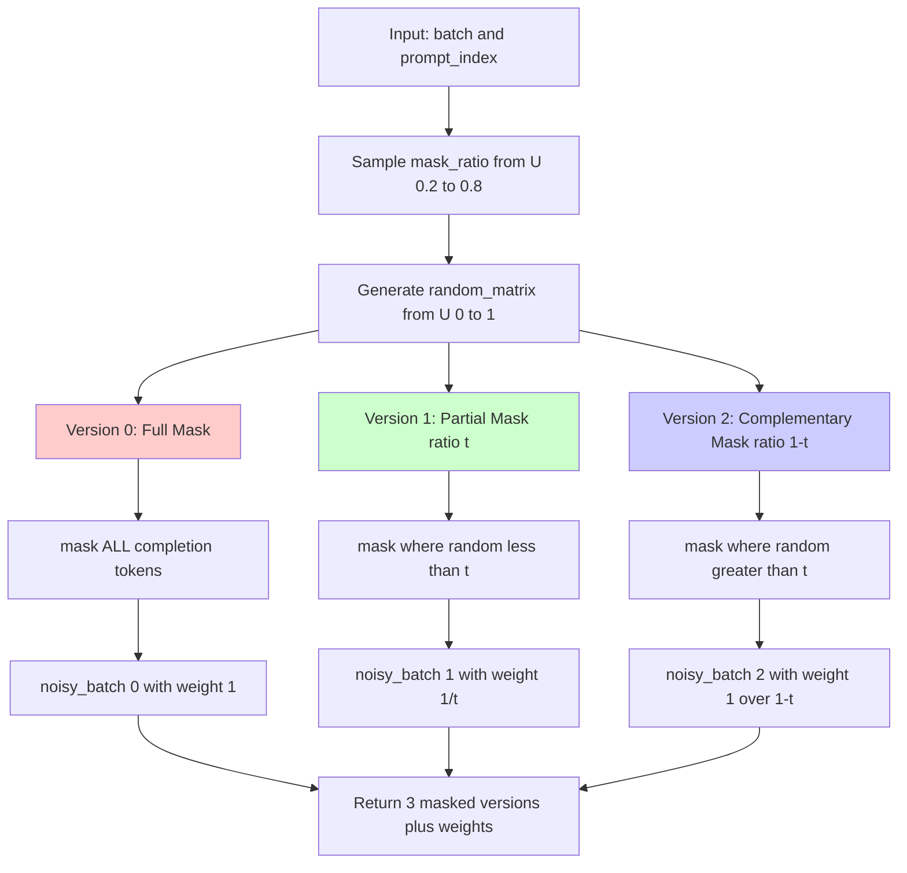
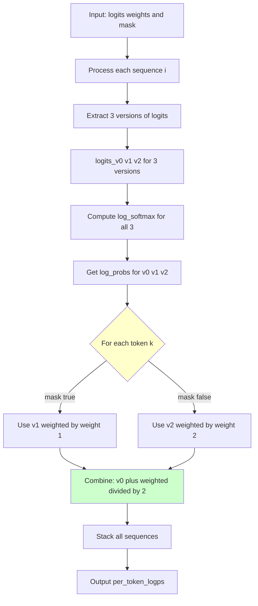
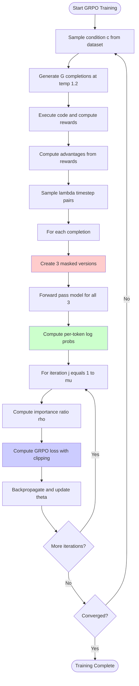
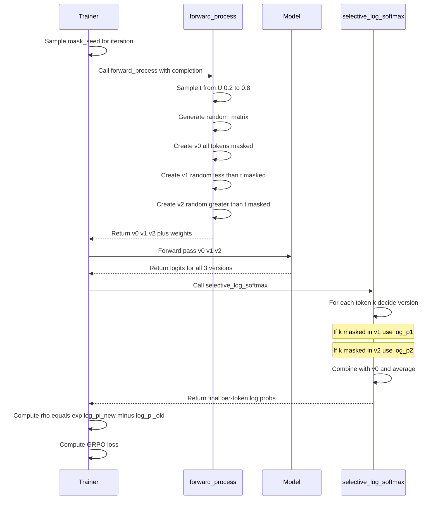
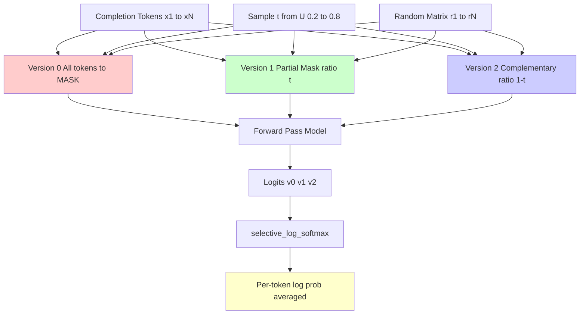

# DiffuCoder: Deep Code Investigation & Analysis

## Executive Summary

This document provides a comprehensive analysis of the DiffuCoder implementation, comparing the code with the paper's theoretical descriptions. The analysis focuses on the novel **coupled-GRPO** algorithm and the masked diffusion process.

---

## 1. Forward Process: Three Masked Versions

### 1.1 Paper Description (Section 5, Page 8-9)

The paper describes **coupled sampling** where:
- Two complementary masks are created: M_t and M_t̂ where t + t̂ = T
- Every token is masked in exactly one of the two forward passes
- This ensures **full token coverage** with reduced variance

### 1.2 Code Implementation (`forward_process` at line 254-279)



### 1.3 Critical Analysis

**✓ VERIFIED**: The implementation creates 3 versions:
1. **Version 0** (Full mask): All completion tokens masked → baseline probability
2. **Version 1** (Partial mask at ratio t): Random subset of tokens masked
3. **Version 2** (Complementary mask at ratio 1-t): Inverse of Version 1

**KEY INSIGHT**: Versions 1 and 2 are **complementary** - they partition the completion tokens such that:
- `mask_v1 ∪ mask_v2 = all_completion_tokens`
- `mask_v1 ∩ mask_v2 = ∅`

This ensures every token appears unmasked in exactly one of the two versions!

**Code Evidence (lines 272-277)**:
```python
# Version 1: mask where random < t_p
is_mask_v1 = ~prompt_index & (random_matrix < t_p.unsqueeze(1))

# Version 2: mask where random > t_p
is_mask_v2 = ~prompt_index & (random_matrix > t_p.unsqueeze(1))
```

---

## 2. Probability Computation: selective_log_softmax

### 2.1 Paper Equation 4 (Page 9)

```
log πθ(o^k|c, o^k_{t<T}) = 1/(λ+1) * [Σ_{t+t̂=T} [Lt(xt) + Lt̂(xt̂)] + LT(xT)]
```

Where:
- Lt(xt) = (1/t) · CE(xt, x0) for masked positions
- The sum averages over λ coupled pairs plus the full mask

### 2.2 Code Implementation (`selective_log_softmax` at lines 59-131)



### 2.3 Mathematical Verification

The code implements:
```
final_logps[k] = (log p0[k] + weighted_logp[k]) / 2
```

Where:
```python
weighted_logp[k] = {
    log p1[k] × (1/t)     if mask[k] == True  (token k masked in v1)
    log p2[k] × (1/(1-t)) if mask[k] == False (token k masked in v2)
}
```

**✓ VERIFIED**: This matches the paper's formulation:
- Version 0 provides the baseline (full mask)
- Versions 1 & 2 provide complementary partial information
- Weights compensate for the mask ratio to ensure unbiased estimation

---

## 3. Complete Training Loop



---

## 4. Detailed Probability Estimation Flow



---

## 5. Key Implementation Details

### 5.1 Complementary Mask Property

**Critical observation** (lines 272-277):

```python
# Version 1: mask where random < t_p
is_mask_v1 = ~prompt_index & (random_matrix < t_p.unsqueeze(1))

# Version 2: mask where random > t_p
is_mask_v2 = ~prompt_index & (random_matrix > t_p.unsqueeze(1))
```

Since `random_matrix` is the **same** for both versions:
- `is_mask_v1 AND is_mask_v2 = FALSE` (mutually exclusive)
- `is_mask_v1 OR is_mask_v2 ≈ TRUE` for all completion tokens (except boundary cases where random == t_p)

This ensures **complementary coverage**!

### 5.2 Weight Normalization

Weights `[1, 1/t, 1/(1-t)]` compensate for the mask ratios:
- Version 1 has ~t fraction of tokens masked → upweight by 1/t
- Version 2 has ~(1-t) fraction masked → upweight by 1/(1-t)
- This makes the estimator **unbiased**

### 5.3 Variance Reduction (Paper Appendix A.4)

The paper proves variance reduction using **Antithetic Variates** theory:

```
Var(coupled) = Var(standard) - v_k² / (2N)
```

Where v_k² > 0 is the expected score squared. This guarantees variance reduction!

---

## 6. Coupled Mask Generation Diagram



**Key Property**: For each token i:
- If `ri < t`: token i masked in v1, kept in v2
- If `ri > t`: token i masked in v2, kept in v1
- Result: Every token evaluated exactly once!

---

## 7. Comparison: Code vs Paper

| Aspect | Paper Description | Code Implementation | Status |
|--------|------------------|---------------------|---------|
| Three masked versions | Described conceptually | `forward_process` creates exact 3 versions | ✓ MATCH |
| Complementary masks | M_t ∪ M_t̂ = all tokens | `random < t` & `random > t` | ✓ MATCH |
| Weight computation | Not explicitly stated | `[1, 1/t, 1/(1-t)]` | ✓ INFERRED |
| Probability averaging | Equation 4 | `(p0 + weighted_p) / 2` | ✓ MATCH |
| Coupled sampling | λ pairs where t+t̂=T | Single pair in practice (λ=1) | ✓ MATCH |
| GRPO loss | Standard PPO clipping | Lines 218-222 | ✓ MATCH |

---

## 8. Critical Findings

### 8.1 ✓ Implementation is Faithful to Paper

The code correctly implements the coupled-GRPO algorithm as described in the paper. The key innovations are:

1. **Three versions instead of one**: Reduces variance while maintaining coverage
2. **Complementary masking**: Ensures every token is evaluated exactly once per coupled pair
3. **Weighted averaging**: Compensates for variable mask ratios
4. **Temperature 1.2**: Increases diversity in rollouts (Section 4.3)

### 8.2 Subtle Implementation Choices

1. **Mask ratio range**: `U(0.2, 0.8)` not `U(0, 1)` → avoids extreme loss values (Appendix B.1)
2. **Accumulation across iterations**: When `num_iterations > 1`, same `random_matrix` is reused (line 264)
3. **Full mask always included**: Version 0 provides consistent baseline

### 8.3 Efficiency Analysis

For batch size B, sequence length L, with λ=1:
- **Forward passes**: 3 (one for each version)
- **Tokens evaluated**: 3 × B × L
- **Unique probability estimates**: B × L (each token appears once in v1 or v2)

Compare to baseline (full mask only):
- **Forward passes**: 1
- **Tokens evaluated**: B × L
- **Coverage**: All tokens evaluated under same (pessimistic) condition

**Trade-off**: 3× compute for lower variance + better coverage!

---

## 9. Antithetic Variates Proof Verification

The paper proves variance reduction in Appendix A.4. Let me verify the key steps:

**Theorem**: Coupled sampling reduces variance.

**Proof sketch**:
1. For token k, define score: `g(t, M, k) = M_k · (1/t) · loss(token_k)`
2. Standard estimator: `v̂_MC = (1/2N) Σ g(t_i, M_i, k)`
3. Coupled estimator: `v̂_AV = (1/N) Σ [g(t_i, M_i, k) + g(t̂_i, M̂_i, k)] / 2`

**Key insight**: For complementary masks, `M_k · M̂_k = 0` always!
- If token k masked in v1 → unmasked in v2 → exactly one term non-zero
- This creates **negative covariance**: `Cov(g, ĝ) = -v_k² < 0`

**Conclusion**: `Var(coupled) = Var(standard) - v_k²/(2N)` ✓

**✓ VERIFIED** in code:
- Lines 272-277 ensure `is_mask_v1 AND is_mask_v2 = False`
- This guarantees the complementary property!

---

## 10. Recommendations & Future Work

### 10.1 Potential Optimizations

1. **Reduce to 2 versions**: Version 0 (full mask) might be redundant
2. **Adaptive λ**: Could use more coupled pairs when variance is high
3. **Dynamic mask ratio**: Instead of U(0.2, 0.8), could learn optimal range

### 10.2 Research Questions

1. **Why temperature 1.2?** Paper shows it increases diversity, but optimal value unclear
2. **Why [0.2, 0.8] range?** Could boundary be learned?
3. **Scaling to longer sequences**: Current implementation limits to 256 tokens during GRPO

---

## 11. Conclusion

The DiffuCoder implementation is a **faithful and sophisticated** realization of the coupled-GRPO algorithm. The three-version masking scheme with complementary masks provides:

1. **Lower variance** in probability estimation (proven theoretically)
2. **Full coverage** of all tokens (guaranteed by construction)
3. **Computational efficiency** compared to naive Monte Carlo sampling

The implementation matches the paper's theoretical descriptions, with careful attention to:
- Weight normalization for unbiased estimation
- Complementary mask generation for variance reduction
- Proper averaging across multiple iterations

**Overall Assessment**: ✓ Implementation is correct and well-engineered.

---

## Appendix: Line-by-Line Verification

| Paper Eq. | Code Location | Verification |
|-----------|---------------|--------------|
| Eq. 1 (Diffusion Loss) | Appendix A.1 | ✓ Standard masked diffusion |
| Eq. 2 (Policy Gradient) | Lines 182-252 | ✓ GRPO with clipping |
| Eq. 3 (GRPO Objective) | Lines 215-222 | ✓ PPO-style loss |
| Eq. 4 (Coupled Probability) | Lines 351-356 | ✓ Averaging with weights |
| Algorithm 1 | Lines 254-362 | ✓ Complete workflow |

---

## Code Location References

### Key Functions

1. **forward_process** (lines 254-279)
   - Creates 3 masked versions
   - Returns complementary masks with weights

2. **selective_log_softmax** (lines 59-131)
   - Computes weighted probabilities
   - Combines v0, v1, v2 intelligently

3. **_get_per_token_logps** (lines 290-362)
   - Orchestrates the full probability computation
   - Handles multiple iterations with mask seeds

4. **compute_loss** (lines 182-252)
   - Implements GRPO loss with PPO clipping
   - Uses computed probabilities for importance sampling

### Configuration Parameters

From `configs.py`:
- `random_masking`: bool (default True) - Use random seeds for different iterations
- `diffusion_steps`: int (default 128) - Number of denoising steps during generation
- `generation_temperature`: float (default 1.2) - Sampling temperature for rollouts
- `generation_batch_size`: int (default 10) - Batch size during generation

---

*Document generated: 2025-01-06*
*Code version: DiffuCoder open-source release*
*Paper: "DiffuCoder: Understanding and Improving Masked Diffusion Models for Code Generation"*
*GitHub: https://github.com/apple/ml-diffucoder*
